# Homework Assignment IV: Hash Function Design & Observation (C/C++ Version)

Developer: YI-FENG HUANG


Email: Blup712019@gmail.com 
## Environment
This project is developed and executed on a Windows environment using the MinGW-W64 toolchain to compile both C and C++ implementations.
The compiler versions used in this project are:
```bash
  g++.exe (MinGW-W64 x86_64-ucrt-posix-seh, built by Brecht Sanders) 14.3.0
  gcc.exe (MinGW-W64 x86_64-ucrt-posix-seh, built by Brecht Sanders) 14.3.0
  ```
  Key characteristics:
  - Compiler Versions: GCC 14.3.0 (C), G++ 14.3.0 (C++)
  - Build System: Windows batch-based Makefile.bat for compilation automation

## Hash Function Design and Pseudocode
In this project I implemented two different hash function for both integer keys and string keys to compare their performance in terms of collision rate and distribution uniformity:
1. Design A – Multiplicative hashing (Knuth’s method)


2. Design B – Squared hashing (hash^2 mod m)


Both designs share the same overall goal:
- mapping keys into the range [0, m - 1],
- reduce clustering patterns,
- and make it easier to compare how table size m affects the distribution of indices in different design.
### Design A: Multiplicative Hashing (Knuth’s Method)
### Pseudocode of Integer Keys
```bash
function myHashInt(int key,int m)
  if m <= 0 then
      return error "Table size m must be > 0"
  end if

  const A = 2654435761 

  unsigned long long hash = key;

  hash = hash * A 

  index = hash mod m

  return index

end function
  ```
#### Rationale
This design multiplies the key by Knuth’s constant A = 2654435761 to spread nearby keys apart before applying mod m.
The idea is to:
- first spread nearby keys apart by multiplying with a large odd constant,
- then fold the result back into [0, m - 1] via mod m.

### Pseudocode of String Keys
```bash
function myHashString(string key,int m)
  if m <= 0 then
    raise error "Table size m must be > 0"
  end if

  if str is empty then
    raise error "String size must be > 0"
  end if

  unsigned hash = 0

  for each character ch in str do
      hash = hash + int(ch)  
  end for

  const A = 2654435761

  hash = hash * A

  index = hash mod m

   return int(index)
end function
```
#### Rationale
The string is first reduced to a numeric value by summing character codes.Then multiplies the results by Knuth’s constant A = 2654435761 to spread nearby keys apart before applying mod m.
The idea is to:
- first reduce the string to a single numeric value
- second spread nearby keys apart by multiplying with a large odd constant,
- then fold the result back into [0, m - 1] via mod m.

### Design B: Squared Hashing
This second design modifies the previous idea by applying a square operation before taking mod m. The goal is to see how an additional non-linear step affects the distribution.
### Pseudocode of Integer Keys
```bash
function myHashInt(int key,int m)
  if m <= 0 then
      return error "Table size m must be > 0"
  end if

  unsigned long long hash = key;

  hash = hash * hash 

  index = hash mod m

  return index
end function
  ```
#### Rationale
This method uses h(k) = k² mod m to introduce a nonlinear transformation.
The key idea is:
- amplify the difference between keys by squaring them (k^2),
- then apply mod m to map them into the table.

### Pseudocode of String Keys
```bash
  function myHashString(string key,int m)
    if m <= 0 then
        raise error "Table size m must be > 0"
    end if

    if str is empty then
        raise error "String size must be > 0"
    end if

    unsigned hash = 0

    for each character ch in str do
        hash = hash + int(ch)  
    end for

    hash = hash * hash

    index = hash mod m

    return int(index)
end function
```
#### Rationale
The string is first reduced to a numeric value by summing character codes.Then use h(k) = k² mod m to introduce a nonlinear transformation.
The key idea is:
- first reduce the string to a single numeric value
- second amplify the difference between keys by squaring them (k^2),
- then apply mod m to map them into the table.

## Experimental Setup
This project evaluates the behavior of two hash function designs under different table sizes and datasets.
### Table Sizes Tested (m)
#### - 10, 11 (prime number), 37 (prime number)
### Test Dataset
#### Integer Keys
```test
21, 22, 23, 24, 25, 26, 27, 28, 29, 30,
51, 52, 53, 54, 55, 56, 57, 58, 59, 60
```
#### String Keys
```test
"cat", "dog", "bat", "cow", "ant",
"owl", "bee", "hen", "pig", "fox"
```
## Results
### 1. Multiplicative Hashing:
#### Integer Keys
| Table Size (m) | Index Sequence                   | Observation                                                                        |
| -------------- | -------------------------------- | ---------------------------------------------------------------------------------- |
| **10**         | 1, 2, 3, 4, 5, 6, 7, 8, 9, 0, …  | Pattern repeats every 10. Non-prime m causes modular cycling and strong linearity. |
| **11**         | 1, 0, 10, 9, 8, 7, 6, 5, 4, 3, … | More uniform. Prime table size breaks the repeated patterns.                       |
| **37**         | 5, 7, 9, 11, 13, 15, …           | Near-uniform distribution. Best spacing among all table sizes.                     |
#### String Keys
| Table Size (m) | Index Sequence (Representative) | Observation                                                         |
| -------------- | ------------------------------- | ------------------------------------------------------------------- |
| **10**         | 2, 4, 1, 9, 3, 8, 0, …          | Several collisions. Non-prime m creates clustering. |
| **11**         | 7, 5, 8, 1, 7, 3, …             | Much more even spread. Fewer collisions due to prime m.             |
| **37**         | 32, 36, 30, 29, 17, 10, …       | Very uniform. No collisions in this dataset.                        |
### 2. Squared Hashing:
#### Integer Keys
| Table Size (m) | Index Sequence (Representative) | Observation                                                            |
| -------------- | ------------------------------- | ---------------------------------------------------------------------- |
| **10**         | 1, 4, 9, 6, 5, 6, 9, 4, 1, 0, … | Strong symmetry. Many repeated values -> high collisions. |
| **11**         | 1, 0, 1, 4, 9, 5, 3, 3, 5, 9, … | Improved over m=10, but symmetry still causes clustering.              |
| **37**         | 34, 3, 11, 21, 33, 10, 26, 7, … | Good spread but still less uniform than multiplicative hashing.        |
#### String Keys
| Table Size (m) | Index Sequence (Representative) | Observation                                                                                 |
| -------------- | ------------------------------- | ------------------------------------------------------------------------------------------- |
| **10**         | 4, 6, 1, 1, 9, 4, 0, …          | High collision rate                                         |
| **11**         | 5, 3, 9, 1, 5, 9, …             | Some improvement, but collisions persist.                                                   |
| **37**         | 34, 28, 3, 16, 26, 25, …        | Best distribution of the three table sizes, still not as uniform as multiplicative hashing. |

## Compilation, build, execution and output
### Folder Structure :
```test
Assignment IV/
│── Makefile.bat          # Windows batch build script
│── README.md
│── README_template.md
│── VSCode.md
│
├── C/                    # C implementation
│    ├── main.c
│    ├── hash_fn.c
│    └── hash_fn.h
│
└── CXX/                  # C++ implementation
     ├── main.cpp         # Multiplicative hashing
     ├── hash_fn.cpp
     ├── hash_fn.hpp
     ├── main2.cpp        # Squared hashing
     ├── hash_fn2.cpp
     └── hash_fn2.hpp

```
### Compilation
This project uses a Windows batch-based Makefile system (Makefile.bat).
All commands must be executed in the root folder Assignment IV/, in CMD.  
```bash
# Build both C and C++ versions 
Makefile.bat all

# Build only C version
Makefile.bat c

# Build only C++ version
Makefile.bat cxx
```
### Clean Build Files
Remove all compiled files:
```bash
Makefile.bat clean
```
### Execution
After building, the executables appear inside the C or CXX directories.
```bash
# Run C version
C\hash_function.exe

# Run C++ version (multiplicative hashing)
CXX\hash_function_cpp.exe

# Run C++ version (squared hashing)
CXX\hash_function_cpp2.exe
```
### Result Snapshot
This section shows creenshots of the program output for both hash function designs:

- Method 1: Multiplicative Hashing

- Method 2: Squared Hashing

### Method 1 — Multiplicative Hashing
#### Integer Output（screenshot） :
| 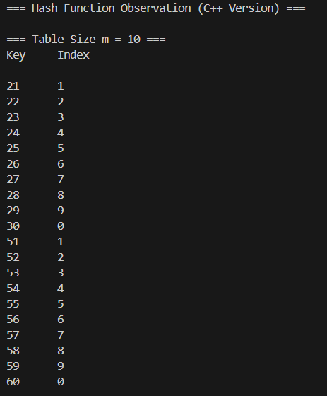 | 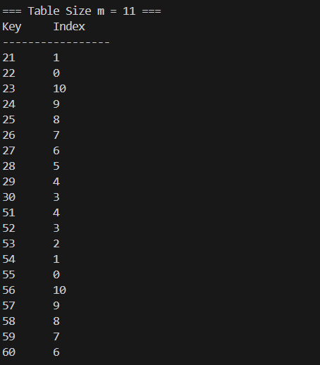 |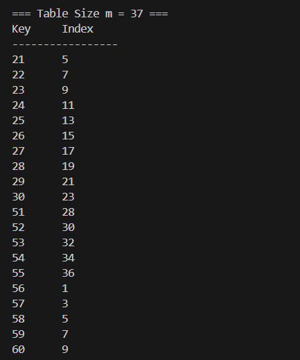 |

#### String Output（screenshot） :
| 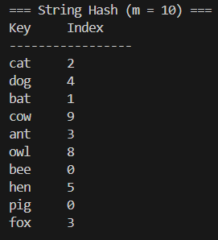 | 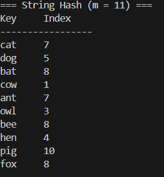 |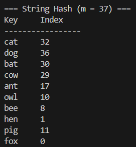 |

### Method 2 — Squared Hashing 
#### Integer Output（screenshot） :
| 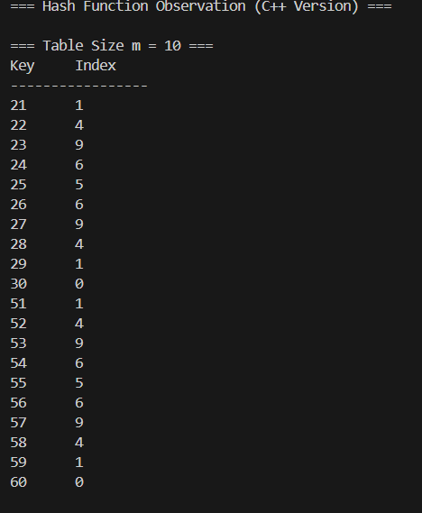 | 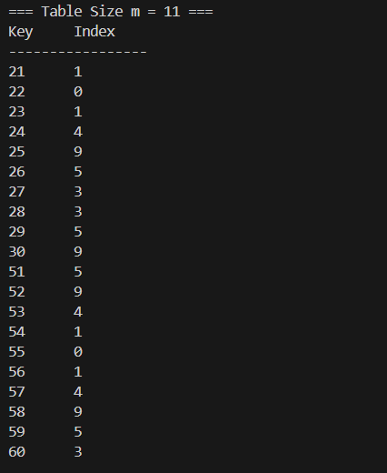 |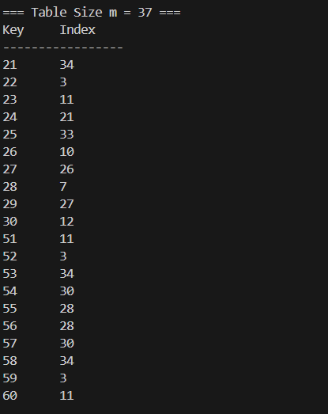 |

#### String Output（screenshot） :
| 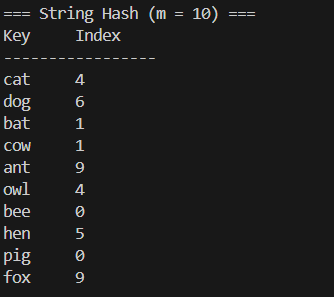 | 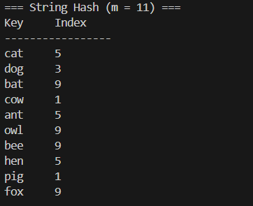 |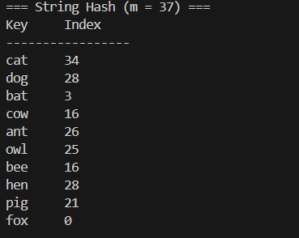 |

