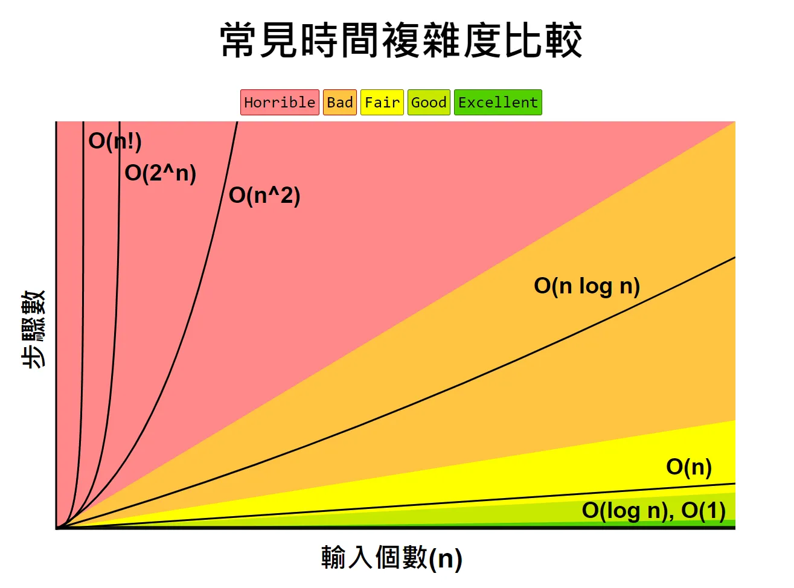

# Data Structures: Introduction

這份筆記整理「資料結構（Data Structure）」的核心概念簡介包含：分類、常見操作、效能分析（時間/空間複雜度）與漸近符號（Big-O/Ω/Θ）等。

## 1. 資料結構是什麼

**資料結構（Data Structure, DS）**：用某種方式組織與存放資料，讓資料的存取、更新、查詢更有效率。  
核心想法：同一批資料，用不同結構呈現，會影響：
- 查詢快不快（搜尋/定位）
- 新增刪除快不快（維護）
- 記憶體用量（空間）
- 實務效能（快取友善、指標跳躍成本）

> 資料結構常和演算法一起討論：  
> 演算法是「怎麼做」，資料結構是「資料怎麼放」，兩者互相決定效能上限。

## 2. 靜態 vs 動態（從記憶體與大小變化看）

### 2.1 靜態資料結構（Static）
特徵：**大小固定**、常見為**連續記憶體**（例如固定長度陣列）。

**優點**
- 存取簡單（index / offset）
- 常數因子通常小、cache 友善

**缺點**
- 容量固定：可能浪費（配太大）或不夠用（配太小）
- 中間插入/刪除常需搬移，成本高

### 2.2 動態資料結構（Dynamic）
特徵：**大小可變**、執行期可擴充/縮減（例如 linked list、tree、graph、hash table、動態陣列）。

**優點**
- 對資料量不確定、頻繁增刪更彈性
- 可按需成長

**缺點**
- 需要額外管理成本（指標、metadata）
- 記憶體可能不連續，對 cache 不利（實務可能較慢）
- 需要處理擴容策略 / 碎片化等工程細節

> 延伸：動態陣列（vector/ArrayList）常見做「倍增擴容」，因此 append 常是 ** O(1)**，但擴容那次會是 O(n)。

## 3. 原始 vs 非原始；線性 vs 非線性

### 3.1 原始（Primitive）
語言/硬體直接支援的基本型別：`int / char / float / double / pointer ...`  
重點：所有複雜結構都是由原始型別 + 記憶體/索引/指標規則組成。

### 3.2 非原始（Non-Primitive）

#### A. 線性（Linear）
資料呈「一條線」的順序關係：每個元素通常有前後位置概念。  
例：Array、Linked List、Stack、Queue、Deque

常見取捨（直覺）：
- **陣列**：讀取快、插入刪除中間慢（搬移）
- **鏈結串列**：已定位後插入刪除快，但搜尋/按索引存取慢（要走訪）

#### B. 非線性（Non-Linear）
元素關係可是一對多、多對多，不是單一路徑。  
例：Tree、Graph、Heap、Hash Table（映射/集合）

常見用途：
- Tree：階層（目錄、組織）
- Graph：關聯網路（社交、路徑）
- Heap：優先隊列（排程、Top-K）
- Hash：快速 key 查找（平均很快，但要看碰撞/分佈）

## 4. 操作分類（Core / Basic / Status / Advanced）

### 4.1 Core（CRUD 骨架）
- **Create**：建立/配置/初始化
- **Insert**：插入元素
- **Read**：讀取元素（不改）
- **Update**：修改元素
- **Delete**：刪除元素

> 很多效能差異出在「定位成本」與「維持不變量」：  
> - 你要先找到位置（search/locate）  
> - 有些結構要維持規則（例如平衡樹旋轉、heapify、re-hash）

### 4.2 Basic（把結構用起來）
- **Access**：依索引/指標/key 取值
- **Search**：找元素/找位置/判斷是否存在
- **Traverse**：遍歷所有元素（線性掃描、DFS/BFS）
- **Copy / Swap / Resize / Initialize / Compare**：拷貝、交換、縮放、初始化、比較

### 4.3 Status（狀態/健康檢查）
常見：
- 容量/內容：`isEmpty / isFull / count / capacity / clear`
- 形狀/順序：`isSorted / isBalanced / isSymmetric`
- 正確性：`isCyclic / isValid`

> 這類常用於 debug、保證不變量、或設計 API（例如容器類別）。

### 4.4 Advanced（進階重組）
- **Sort**：排序（為了更快查找、合併、或使用雙指針技巧）
- **Merge**：合併（特別是兩個已排序序列可線性合併）
- **Split**：切分
- **Reverse / Rotate**：反轉、旋轉（常見於循環結構、array rotation、字串處理）

## 5. 複雜度：時間與空間

### 5.1 時間複雜度（Time Complexity）
用輸入大小 `n` 表示執行時間的增長趨勢（通常看「基本操作次數」）。

常見角度：
- **Worst-case**（最壞）
- **Average-case**（平均）
- **Best-case**（最好）
- **Amortized**（攤銷）：平均攤到每次操作的成本（例如動態陣列擴容）

### 5.2 空間複雜度（Space Complexity）
用 `n` 表示記憶體需求的增長趨勢。

別只看輔助陣列，還要看：
- 結構 overhead（指標、bucket、metadata）
- 遞迴深度（call stack）
- 記憶體連續性與碎片化（實務效能）

## 6. 漸近符號：O、Ω、Θ（加值：o、ω）

令 `T(n)` 表示演算法/操作在輸入規模 `n` 的成本。

### 6.1 Big-O：上界（不會長得比它更快）
`T(n) ∈ O(g(n))`  
直覺：`T(n)` 最多就像 `g(n)` 那樣增長（忽略常數/低階項）。

### 6.2 Big-Ω：下界（至少那麼慢）
`T(n) ∈ Ω(g(n))`  
直覺：`T(n)` 至少會像 `g(n)` 那樣增長。

### 6.3 Big-Θ：緊界（上下都卡住）
`T(n) ∈ Θ(g(n))`  
直覺：`T(n)` 就是那個量級，既是 O 也是 Ω。

### 6.4（加值）小 o 與小 ω
- `T(n) ∈ o(g(n))`：嚴格更慢（成長率更小）
- `T(n) ∈ ω(g(n))`：嚴格更快（成長率更大）

## 7. 常見複雜度等級與直覺

*Reference*: [Click here](https://andyli.tw/time-complexity/)
| 等級 | 直覺 | 常見例子 |
|---|---|---|
| O(1) | 常數時間 | 陣列取值、stack push/pop（不擴容） |
| O(log n) | 每次砍半 | 二分搜尋、平衡 BST 查找、heap 操作 |
| O(n) | 掃一遍 | 遍歷、找最大值 |
| O(n log n) | 分治/排序常見 | merge sort、heap sort、quick sort 平均 |
| O(n²) | 雙層迴圈 | 所有 pairs 比較、簡單排序（bubble/selection） |
| O(n³) | 三層迴圈 | 基本矩陣乘法 |
| O(2^n) | 枚舉子集合 | subset brute force、某些未剪枝遞迴 |
| O(n!) | 枚舉排列 | 全排列、TSP 暴力 |

實務粗略感覺：
- `n` 上千：`O(n²)` 可能就很吃緊
- `n` 上萬：通常要往 `O(n log n)` 或 `O(n)` 走
- 指數/階乘：通常只能 `n` 很小、或要剪枝/DP/近似

## 8. 總結

- **資料結構的目的**
  - 透過更好的資料組織方式，提升**查詢、更新、遍歷**等操作效率
  - 影響面向包含：**時間成本、空間成本、實務效能（快取友善/指標跳躍）**

- **主要分類觀念**
  - **靜態 vs 動態**
    - 靜態：大小固定、常見連續記憶體 → 存取快、但容量不彈性、插入刪除常需搬移
    - 動態：大小可變、可擴充縮減 → 彈性高、但有指標/管理 overhead，可能較不快取友善
    - 動態陣列常用倍增擴容 → `append` **O(1)**（擴容當次 O(n)）
  - **原始 vs 非原始**
    - 原始：語言/硬體直接支援的基本型別（int/char/float…）
    - 非原始：由原始型別組合而成的更高階結構
  - **線性 vs 非線性**
    - 線性：順序關係（Array、Linked List、Stack、Queue…）
    - 非線性：階層/網路/映射（Tree、Graph、Heap、Hash…）

- **操作框架（怎麼「用」資料結構）**
  - **Core（CRUD）**：Create / Insert / Read / Update / Delete
  - **Basic**：Access / Search / Traverse + Copy/Resize/Compare 等
  - **Status**：isEmpty/isFull/count/capacity + isSorted/isBalanced/isCyclic/isValid 等健康檢查
  - **Advanced**：Sort / Merge / Split / Reverse / Rotate（重組資料以利查詢或處理）

- **效能分析重點**
  - **時間複雜度**：worst / average / best / amortized
  - **空間複雜度**：除輔助空間外，還要考慮結構 overhead、遞迴深度、碎片化與快取影響

- **漸近符號（共同語言）**
  - **O**：上界（不會比某成長率更快）
  - **Ω**：下界（至少那麼慢）
  - **Θ**：緊界（上下都卡住）
  - （加值）**o / ω**：嚴格更慢 / 嚴格更快

- **複雜度等級直覺**
  - 常見：O(1)、O(log n)、O(n)、O(n log n)、O(n²)…O(2^n)、O(n!)
  - 規模感：`n` 上千 → O(n²) 可能吃緊；`n` 上萬 → 通常要 O(n log n) 或 O(n)
